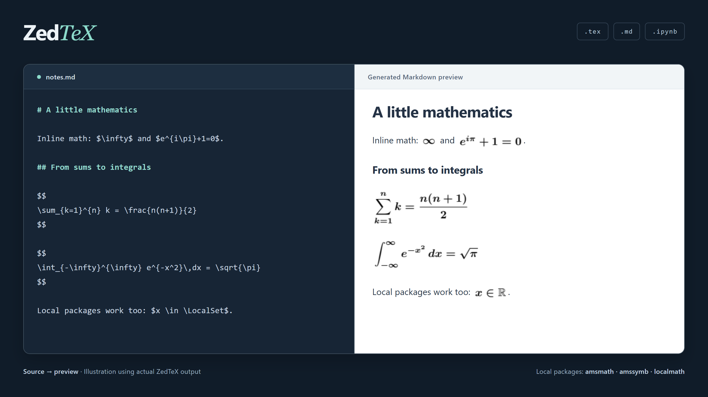

ZedTeX adds LaTeX previews and notebook exports to Zed, with support for real TeX packages.

| File | Result |
| --- | --- |
| `.tex` | PDF and page previews inside Zed |
| `.md` | A Markdown preview with rendered equations |
| `.ipynb` / Python notebook | HTML or PDF with freshly executed outputs |

## Install

**Registry submission pending.** For now, clone this repository and select it through Zed’s **Install Dev Extension**. [Dev setup and updates →](DEVELOPMENT.md#development)

Once published, install **ZedTeX** from the Extensions UI. The renderer downloads automatically. Also install **LaTeX** for `.tex` language support.

## Preview and export

Open a saved source file, press **Ctrl+Shift+P** (**Cmd+Shift+P** on macOS), and run **editor: toggle code actions**.

- **TeX:** choose **LaTeX: build and open preview**. The first page opens in Zed’s image viewer.
- **Markdown:** choose the same action, then press **Ctrl+Shift+V** (**Cmd+Shift+V** on macOS) in the generated `preview.md` tab.
- **Notebooks:** choose **Notebook: run all cells and export to HTML** or **PDF**. The notebook’s Jupyter kernel and dependencies must be installed on the machine running the renderer.

Keep editing the original file; saving updates an activated preview. Unchanged equations are reused, and notebook exports run separately so previews stay responsive. Generated files stay in the user cache, outside your repository—save a copy of exports you want to keep.

Markdown math appears in the generated preview. Zed’s original Markdown preview is unchanged. For live Jupyter equations, see the [rendering helper](DEVELOPMENT.md#jupyter-and-exports).



## LaTeX packages

TeX documents use their own preambles. For Markdown and notebooks, place `latex-preamble.tex` beside the source:

```tex
\usepackage{amsmath,amssymb,mathtools}
\boldmath
% \usepackage{localmath} % optional local .sty file
```

The preamble configures packages; preview the document, not the preamble itself.

[Technical details](DEVELOPMENT.md) · [License](LICENSE)
