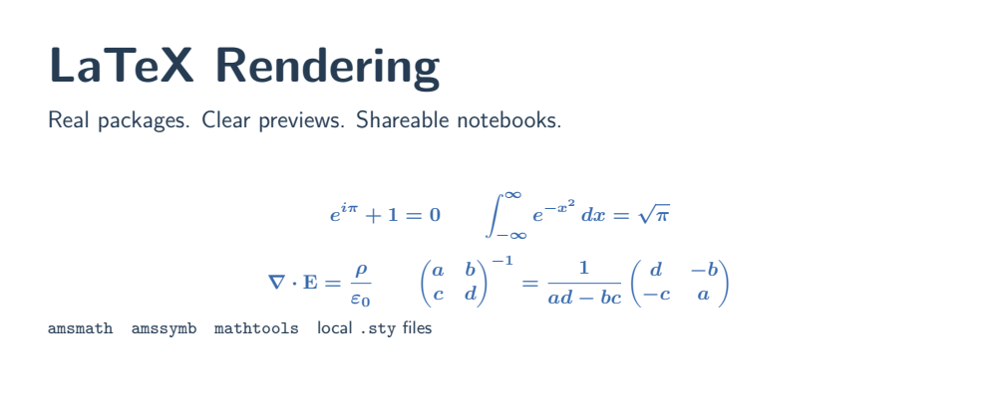

Render real LaTeX while using **official Zed**. Keep your packages, preview your work, and export notebooks.

| What you write | What you get |
| --- | --- |
| **TeX documents** | A real PDF and page images you can view inside Zed. |
| **Markdown** | A preview copy with beautifully rendered equations. |
| **Jupyter notebooks** | Equation images and HTML/PDF exports with saved outputs. |

## Install

**Not yet published in Zed's registry.** The extension and automatic renderer downloads are being tested. Once approved, installation will be through Zed's Extensions UI—no installer scripts, task files, or custom editor build.

## Use

Open a saved document and choose an action from Zed's **code-actions menu**:

- **LaTeX: build and open preview** — TeX or Markdown. Save to update it.
- **LaTeX: insert Jupyter rendering helper** — run the inserted Python cell, then use `tex(r"x^2")`.
- **Notebook: export saved document to HTML/PDF** — open a saved `.ipynb` as JSON. Export does not rerun code.

TeX previews use Zed's image viewer. Markdown previews use generated image links. Your original files stay intact.

## Bring your packages

TeX files use their own preambles. For Markdown and notebooks, put `latex-preamble.tex` beside the source:

```tex
\usepackage{amsmath,amssymb,mathtools}
\usepackage{localmath} % your local .sty file
\boldmath
```

## Built to stay responsive

Unchanged equations are cached. Saves are coalesced, compilation runs in the background, and pages are rasterized one at a time. TeX may still need a full compile when layout or references change.

**A few limits:** page images are not a native PDF viewer; live Jupyter math uses the helper cell; the helper and kernel must run on the same machine. Raw notebook Markdown cells are rendered during export. Python scripts do not store live REPL outputs.

[Examples](examples) · [Technical details](DEVELOPMENT.md) · [License](LICENSE)
